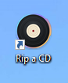
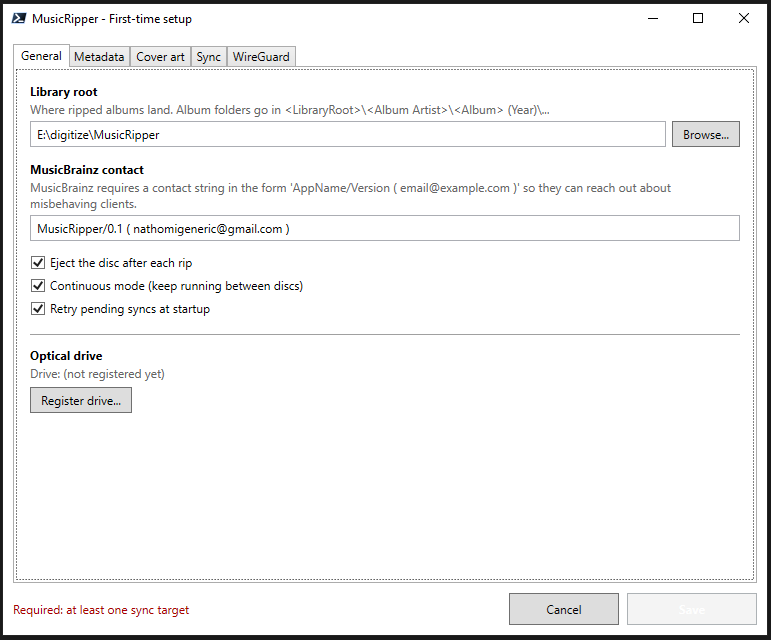
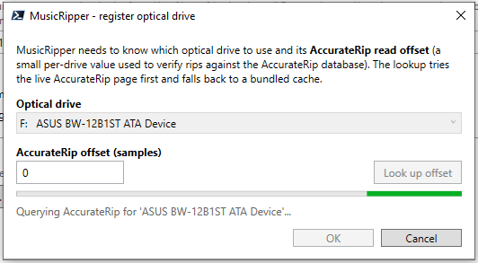
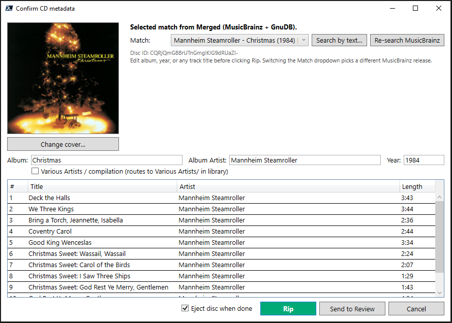
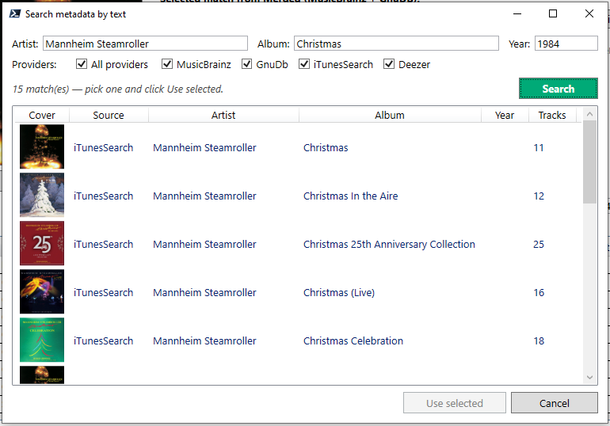
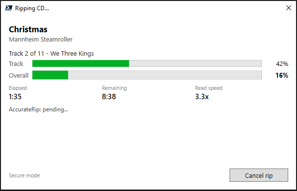
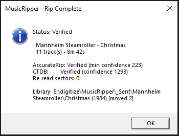
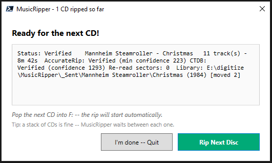
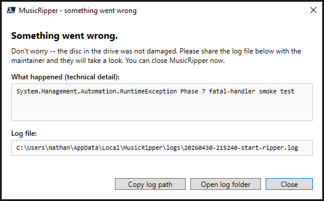
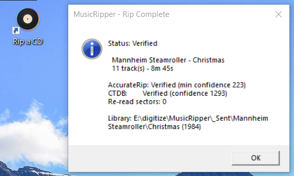

# Parents' Quickstart

One page. One CD at a time. No PowerShell.

## What you got

A **Rip a CD** shortcut on the Desktop. Double-click it whenever you
want to digitize a CD. That's the whole thing.



---

## Step 1 — First launch (one time only)

The very first time you double-click **Rip a CD**, a **Settings**
window opens. Fill in:

- **Library root** — the folder on this PC where your ripped CDs will
  live. Pick a spot with plenty of room (one CD ≈ 400 MB).
- **MusicBrainz contact email** — your real email. The free
  metadata service asks for it so they can reach you if your queries
  cause trouble; they won't email you otherwise.
- Click **Register drive...** — a small window calibrates your CD
  drive. Takes about 30 seconds. Just wait for it.





Click **Save**. The Settings window closes and you're ready to rip.

If your engineer set you up with **OneDrive** or **NAS sync**, those
options are on the **Sync** and **WireGuard** tabs of the Settings
window. They should already be filled in for you — leave them alone.

---

## Step 2 — Ripping a CD

1. **Insert a CD** into the drive.
2. **Double-click "Rip a CD"** on the Desktop.
3. A small dialog pops up showing the album, artist, year, and cover
   art for the disc you just inserted. Look it over.

   

   - If everything looks right (it almost always does for popular
     albums): click **Rip**.
   - If something looks wrong: pick a different match from the list,
     or click **Search** to type the artist/album by hand.

     

   - If you're not sure: click **Send to Review** — the rip will
     happen but land in a special folder so you (or the engineer)
     can fix the metadata later.

4. The progress window appears. The rip itself takes 4–10 minutes
   depending on the disc; tagging + sync takes another minute or two.
   Walk away — you don't need to babysit it.

   

5. When it finishes, the tray pops open and a **"Rip Complete"**
   message appears with the album name. Take the disc out.

   

---

## Step 3 — Ripping a stack of CDs

After each successful rip, MusicRipper shows a **Ready for the next
CD!** window with the result of the last rip and two buttons:

- **Rip Next Disc** (or just put the next CD in — it auto-detects).
- **I'm done — Quit**.



So a typical session is: insert a CD, click the shortcut, click
**Rip**, walk away, come back, eject, insert the next one. Repeat
until the stack is gone, then click **I'm done — Quit**.

---

## Step 4 — When something goes sideways

### "We couldn't identify this CD"

Some CDs (homemade compilations, very obscure releases, or discs
manufactured before the 2000s) don't show up in MusicBrainz. The
metadata dialog will say so and offer **Send to Review**. Click
that — your CD still gets ripped cleanly, it just lands in
`<library>\_ReviewQueue\` instead of the main library. Tell the
engineer; they'll sort it out using the
[Review Workflow](REVIEW-WORKFLOW.md) runbook.

### "This CD is already in your library"

You already ripped it. The dialog gives you three choices:

- **Skip** — close the dialog, eject the disc.
- **Open folder** — see where the existing copy lives.
- **Rip again** — make a side-by-side copy (lands as
  `<Album> [rip 2]\`).

Most of the time you want **Skip**.

### A red error window with a "Copy log path" button

Something unexpected went wrong. The CD in the drive is fine — nothing
was damaged. Click **Copy log path**, paste it into a message to the
engineer, and close the window.



---

## Step 5 — Changing settings later

Need to point MusicRipper at a different folder, add the family NAS,
or refresh a password? Open the Start Menu and click
**MusicRipper - Settings**. The same window from first-run opens, with
your current settings pre-filled. Change what you need and click
**Save** — a little message confirms *"New settings will apply the
next time MusicRipper runs."*

It's safe to open Settings even while MusicRipper is busy ripping a
CD; the changes just queue up for the next time you launch the app.

---

## Step 6 — Updating MusicRipper

Every now and then your engineer ships a new version with bug fixes
or new features. To get it:

1. Open the Start Menu (or press the Windows key) and type
   **MusicRipper - Update**. Click the result.
2. A small window appears that says *"Checking for updates..."*. Wait
   a few seconds.
3. One of three things will happen:
   - **"You're up to date."** — Click **OK**. Nothing to do.
   - **"Update available: vX.Y"** — A panel shows what's new. Click
     **Update now**. The window will say *"Downloading"*,
     *"Extracting"*, *"Installing new files"*, then
     *"Update complete!"*. Click **OK**.
   - **"Couldn't check for updates"** — Usually means the internet
     is down or GitHub had a hiccup. Click **Retry** in a minute, or
     **Cancel** and try later.

That's it. The next time you click **Rip a CD**, you're on the new
version. Your library, your settings, and your saved NAS password are
all left alone — only the program files get refreshed.

If anything goes wrong (very rare), the previous version is kept on
disk as a backup so your engineer can roll back manually.

---

## Where do my CDs end up?

Inside the **library folder** you picked during first-run setup,
arranged like this:

```text
<library>\
  Pink Floyd\
    The Wall (1979)\
      01 - In the Flesh.flac
      02 - The Thin Ice.flac
      ...
      cover.jpg
  Various Artists\
    NOW That's What I Call Music! 99 (2018)\
      ...
```

Plex, foobar2000, iTunes, and every other music app understand this
layout. Point them at the library folder and they'll find your CDs.

If your engineer enabled **OneDrive** or **NAS sync**, each finished
album also gets copied off this PC for safety. The engineer chose
one of:

- **Keep** (default): the album stays here forever. Safe.
- **Move to `_Sent`**: it's moved into a `_Sent` subfolder so you
  can see what's been pushed off-box.
- **Send to Recycle Bin**: the local copy goes to the Recycle Bin
  (recoverable for 30 days) once the off-box copy is confirmed.

If a sync target is offline (NAS off, internet down) the album just
stays in the library and gets retried next time MusicRipper launches.
Nothing is ever lost.

---

## TL;DR



1. Insert CD.
2. Double-click **Rip a CD**.
3. Click **Rip**.
4. Wait for the green check.
5. Eject, repeat.

Done.
